# Usage IQ — *the Hub*

A self-hosted **personal + family hub** and an end-to-end **showcase of full-stack + agentic-AI engineering**. It began as **AI usage intelligence** — filter and visualize your AI coding-agent token spend across **Claude Code + OpenAI Codex** — and grew into an *agentic-OS-lite* for everyday life: a **Family Hub** (shared calendar, lists, meals, chores, finance, locations, a private cycle tracker), a **food & fitness life tracker**, **real-time team chat**, and **AI woven throughout** — all behind **one Google sign-in**, **one granular permission catalog**, and a per-user **home-page picker** so each person lands where they live.

One Angular 21 SPA, one .NET 9 API, one PostgreSQL database. Live at **[usageiq.online](https://usageiq.online)** (auto-deployed to AWS on push-to-main).

[](https://github.com/itdept-ops/usage-iq/actions/workflows/ci.yml)

<a href="https://www.buymeacoffee.com/itdept"></a>

> Built with Angular 21 (standalone + signals) · .NET 9 minimal API · EF Core · PostgreSQL · SignalR · Google Gemini · Leaflet · ECharts · Docker · AWS.

## What's inside

Usage IQ is several products under one roof — each gated by its own permissions, so you grant exactly what a friend, family member, teammate, or your kids should see:

| Pillar | What it is |
| --- | --- |
| 🧠 **AI usage intelligence** | The original core — multi-tool token/cost analytics with dedup, pricing, fleet leaderboards, a usage heatmap, public share links, and a remote reporter/desktop agent. |
| 🏡 **Family Hub** | A household OS — shared **calendar** (Google-synced), **lists**, **notes**, **reminders**, **meal planner**, **chores**, **polls**, **finance**, **"Where's everyone"** locations, and a private **cycle** calendar. |
| 💪 **Fitness & life tracker** | A food + exercise log with macros (USDA/FatSecret/barcode), workouts (library + WorkoutX), body stats, **hydration**, watch activity, and a weight trend — shareable read-only with your circle. |
| 💬 **Team chat** | Real-time SignalR channels + DMs with reactions, typing, unread, and in-app/browser notifications. |
| 📍 **Locations** | Opt-in GPS — your own private history map, fleet machines by IP-geo, and an admin/family map. |
| ✨ **AI everywhere** | Google Gemini woven through the Hub — schedule-from-photo, day/meal/finance coaches, a family assistant — strictly **gated** and **off by default** for everyone. |

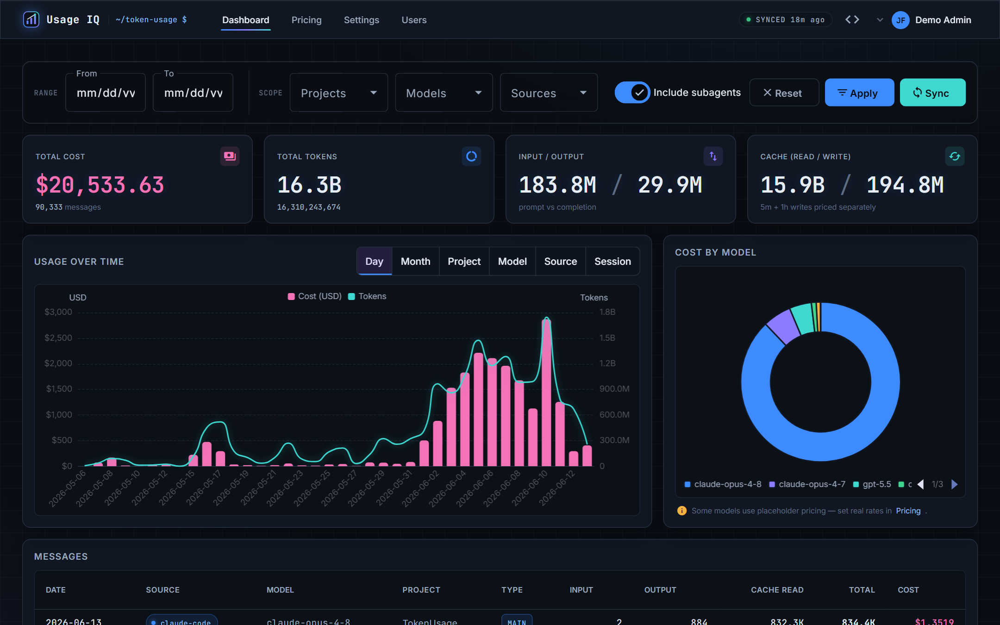

## Screenshots

|  |  |
| --- | --- |
| **Landing** — Google sign-in | **Users & permissions** — per-user matrix |
| 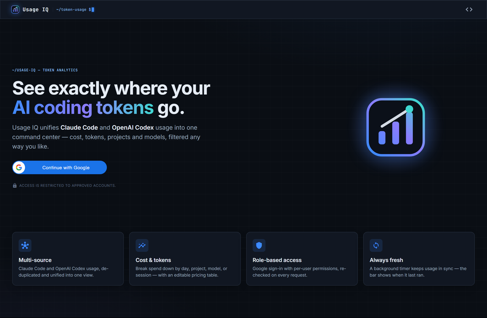 | 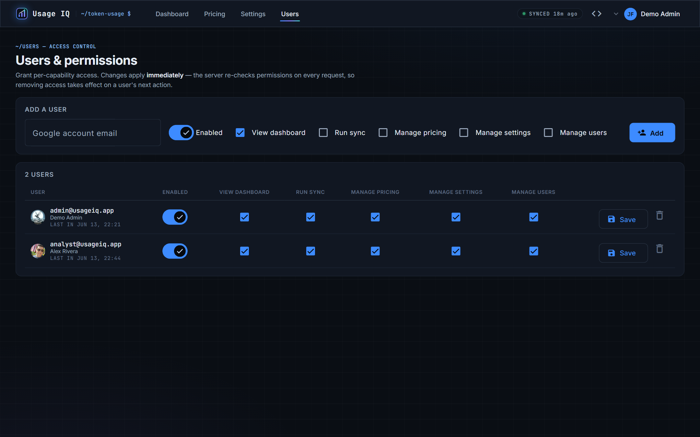 |
| **Pricing** — editable per-model rates | **Settings** — sources, timezone, auto-sync |
| 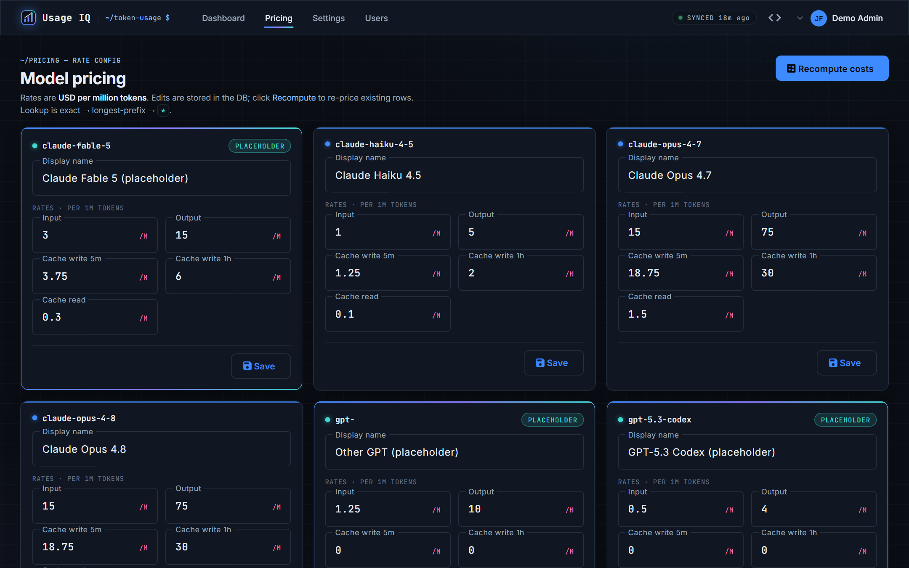 | 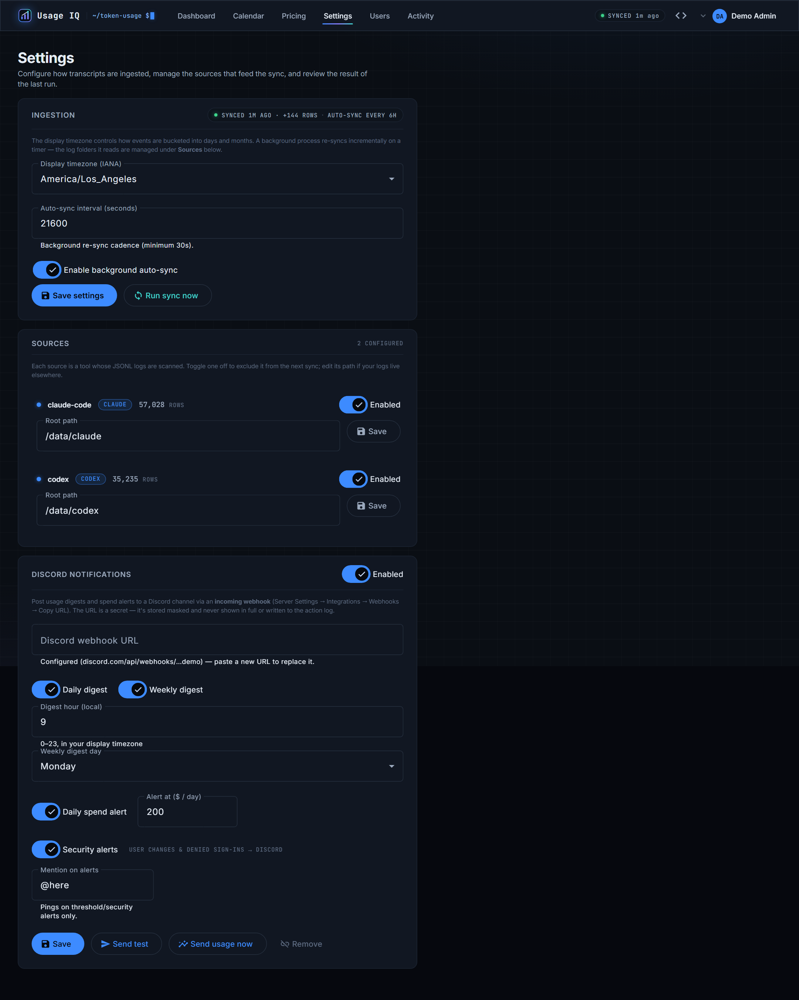 |
| **Activity** — request/response action log | **Calendar** — daily heatmap + active hours |
| 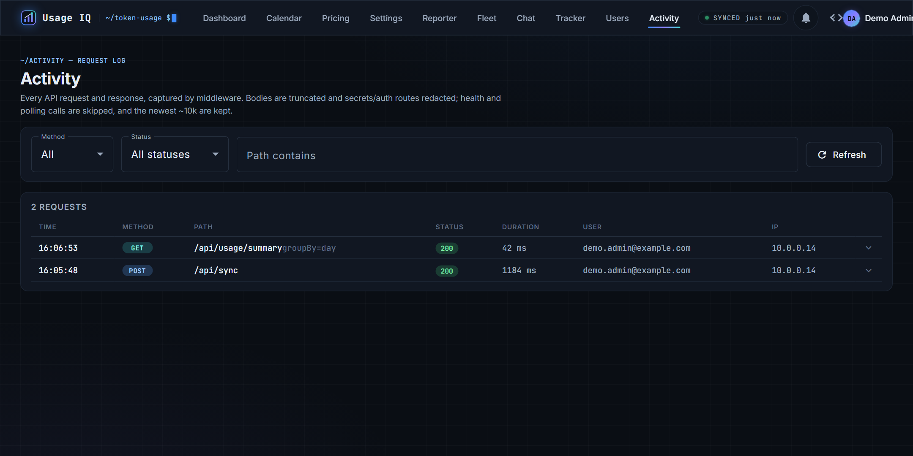 | 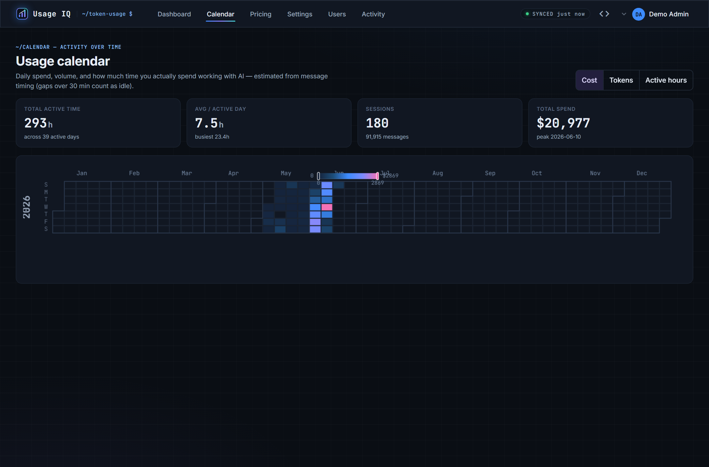 |
| **Pop-out widget** — Claude | **Pop-out widget** — Codex |
| 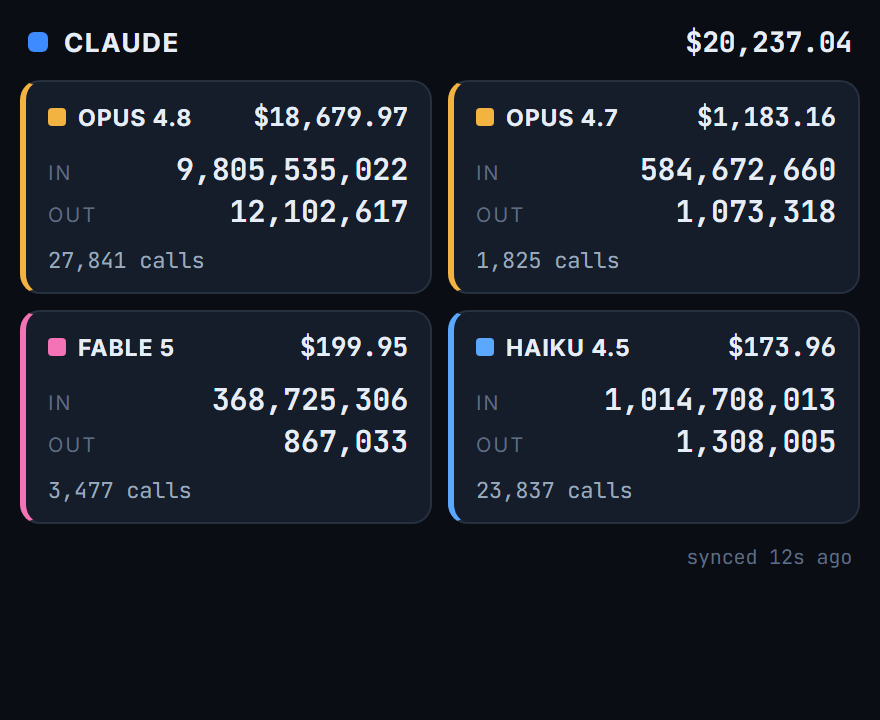 | 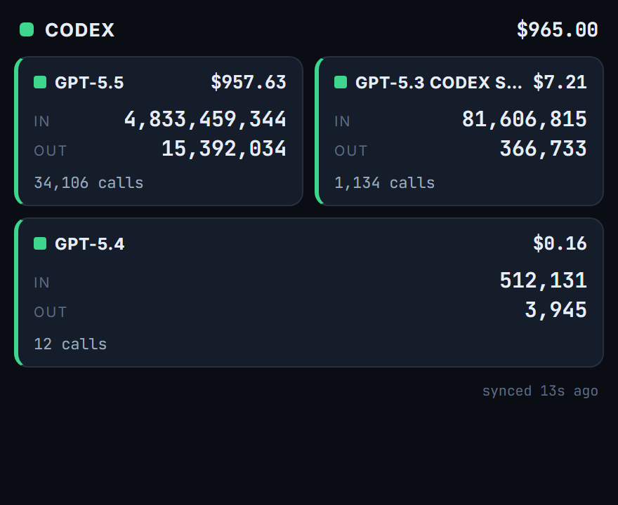 |
| **Team chat** — channels, DMs, reactions, unread | **Food & fitness tracker** — calories, macros, exercise |
| 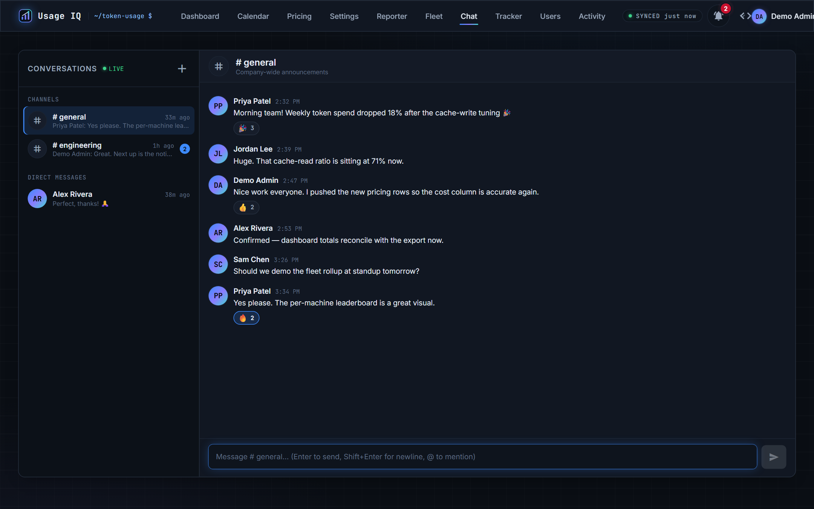 | 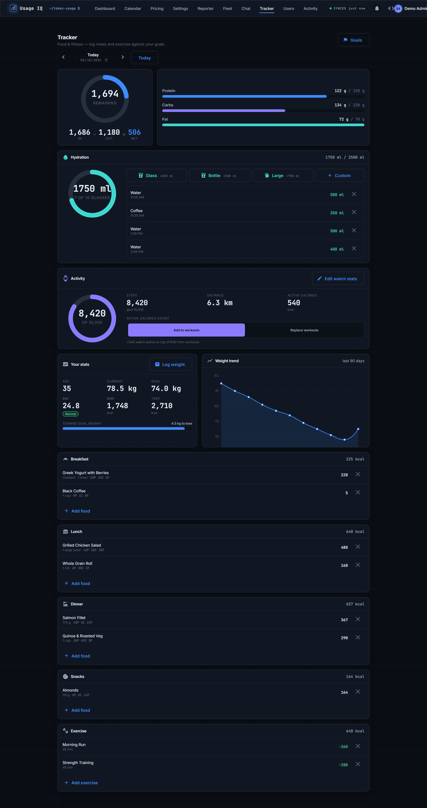 |

**Public share link** (read-only, no login, time-limited) and its management dialog (copy anytime, edit expiry, per-view IP, revoke):

| | |
| --- | --- |
|  |  |

---

## Why

Claude Code writes a JSONL transcript for every session under `~/.claude/projects/`. Those files contain per-message token `usage` (input, output, and 5-minute / 1-hour cache writes + cache reads) but **no cost**, and a single API turn is echoed across **many** lines. This app turns that raw firehose into an accurate, filterable picture of where your tokens and dollars go.

It mirrors how the [`ccusage`](https://github.com/ryoppippi/ccusage) CLI computes usage, but as a persistent, queryable web app — no npm dependency, and a pricing table you can edit.

## Sources

Pluggable per-tool parsers (add more by implementing `ISourceParser`):

| Source | Reads | Notes |
| --- | --- | --- |
| **Claude Code** | `~/.claude/projects/**/*.jsonl` | De-dups on `message.id + requestId`; 5m/1h cache-write + cache-read tiers. |
| **Codex** (OpenAI) | `~/.codex/**/rollout-*.jsonl` | One row per `token_count` event using the per-turn `last_token_usage` delta; `cached_input_tokens` → cache-read, reasoning folded into output. |

Each source is enable/disable-able with an editable path on the **Settings** page.

## Features

- **Filter** by date range, project, model, **source**, and main-vs-subagent (sidechain) usage.
- **Quick date presets** — last 7 / 30 / 90 days, month-to-date, or all-time — alongside explicit from/to.
- **Shareable views** — create a **public, time-limited share link** (`Share…`): a 256-bit token that lets anyone — **no login** — see read-only totals + charts for the scope you chose, until it expires. Links are fully manageable: **copy anytime, edit the expiry/label, revoke**, and expand each link to see **every view's time + IP**. Tokens are encrypted at rest (a hash keys the lookup) and kept out of the action log; the public view never exposes individual messages.
- **Usage calendar** — a GitHub-style heatmap (cost / tokens / **active hours**) with estimated time-spent-with-AI per day (gap-based sessionization), busiest-day and session stats.
- **Pop-out stat widgets** — small, chrome-less per-company windows (Claude / Codex) showing each model's cost + IN/OUT tokens + calls, auto-refreshing on sync — sized for screen-share or capture.
- **Group** the time series by day, month, project, model, source, **machine**, or **user**.
- **Fleet view** — per-**machine** and per-**user** leaderboards (cost, tokens, last-seen, expandable), so a team can see who and what is spending. Usage is attributed to the posting machine and to the ingest key's owner (server-derived, so it can't be spoofed).
- **Cache-efficiency insight** — the share of input served from cache and the **dollars saved** by caching vs. paying full input price (plus cache-write cost), as a dashboard card.
- **Saved views** — name and save a filter set, then re-apply it in one click (per-user).
- **Cost in USD** from an **editable per-model pricing table** (5m / 1h cache-write and cache-read tiers priced separately).
- **Charts**: usage-over-time (cost + tokens), top-N by dimension, and a cost-by-model donut (ECharts).
- **Sortable, paged message table** with project, model, token breakdown, and cost.
- **CSV export** of the currently-filtered rows, streamed from the server (no in-memory buffering).
- **One-click Sync** that incrementally re-reads only changed files.
- **Background auto-sync** on a timer (a .NET hosted service) + a live **"Synced Xm ago"** status in the command bar.
- **Audit log** of every user-management change — who did what, to whom, and when — on the Users page.
- **Action log** — every API request & response captured by middleware (truncated, with auth routes / secret fields / query-string tokens redacted; health and polling skipped), browsable and filterable on an admin **Activity** page.
- **Discord notifications** — daily/weekly spend digests (with **trend ▲▼** vs the previous period and a **top project/model breakdown**), a daily spend-threshold alert, **security alerts** (user changes + denied sign-ins), an on-demand **"send usage now"** snapshot (today / 7d / month / all-time), and optional **@here/role mentions** on critical alerts — all via an incoming webhook (validated to genuine Discord hosts, redirects refused, stored masked, redacted from the action log).

## Team chat & notifications

Real-time, in-app messaging on a **SignalR** hub (`/api/hubs/chat`) — no third-party chat service.

- **Channels & direct messages** — create channels (public or private) or open a 1:1 DM with another user; message history is cursor-paged and every conversation carries a live **unread count**.
- **Live & lively** — **emoji reactions**, **typing indicators**, and instant delivery over a WebSocket; a new DM/channel surfaces to the other party in real time.
- **Notifications everywhere** — an in-app **bell** with unread badge, in-app **toasts**, and opt-in **browser notifications** (the SPA asks for permission on a real click), with **per-user triggers** so nobody drowns in noise.
- **Moderation** — anyone can edit/delete their own messages; a `chat.moderate` holder can edit/delete **other people's** messages and **archive** channels.
- **Curated circles** — admins (`chat.contacts.manage`) maintain each user's **contacts** (their circle of who they can DM); contact pairs are mutual.
- Permission-gated end to end: `chat.read` (see + read), `chat.send` (post, create channels, start DMs, react), `chat.moderate`, `chat.contacts.manage`. The hub re-checks the DB permission on **every** call, so a revoked grant takes effect immediately.

## Food & fitness tracker

A per-user **food & fitness log** with a daily calorie/macro roll-up against a goal — gated by `tracker.self` (own log) and `tracker.viewall` (coach/admin read-everyone).

- **Meal logging** — breakfast / lunch / dinner / snacks, each with **calories + macros** (protein/carbs/fat), backed by **USDA FoodData Central** with a **FatSecret** fallback search, **barcode scanning** (UPC/GTIN), and auto-saved **"My foods"** for manual entries. Nutrition is snapshotted at log time, so editing a source later never rewrites history.
- **Exercise logging** — pick from a built-in **exercise library** (MET-based **calories-burned** estimate from your weight + duration) or the **WorkoutX** catalog (animated GIF demos, a **per-minute** calories-burned auto-estimate), with **manual override**; reuse your saved **"My exercises"**.
- **Body stats** — **BMI**, **BMR/TDEE**, and a **weight trend** from your private weight history (visible only to you).
- **Hydration** — a daily fluid counter with quick-add and a goal ring.
- **Watch activity** — daily **steps, distance, and active calories** that factor into the day's **net calories** (add-on or override).
- **Sharing** — flip on *share with contacts* to let your **chat circle** view your log read-only; coaches/admins with `tracker.viewall` can view everyone. **Writes are owner-only** — a viewer can look but never edit — and private body metrics (weight, BMI/BMR/TDEE) are never exposed to a viewer.

## Family Hub

A warm, household-private section (gated by `family.use`) that turns the app into a shared family operating system. Members belong to a **household**; everything below is scoped to it.

- **Calendar** — a Sunday–Saturday week / **month** / agenda calendar backed by each member's **own Google Calendar** (OAuth code flow, encrypted refresh token; the secret never touches the browser). Create/edit/delete events, find a free time across members, **bulk-add** AI-extracted events, and — with each member's opt-in — see a **color-coded family overlay** of everyone's events. Drop in a **photo/PDF/screenshot of a schedule** and AI drafts the events for you to confirm (images are digested, never stored).
- **Meal planner ↔ macros ↔ grocery ↔ tracker** — plan the week's meals; the planner pulls each meal's **macros**, can push a planned meal straight into your **fitness tracker** as a logged meal, and extrapolates ingredients into the **grocery list** — all from the same data.
- **Lists · Notes · Reminders · Timer · Polls** — shared grocery/to-do/wish lists, family notes, nudges, shared countdowns, and "pick a time / settle a plan" polls.
- **Finance** — extra-sensitive, double-gated by `family.finance` on top of `family.use`; budgets, bills, and balances with an "explain my month" + money-coach AI.
- **"Where's everyone"** — a household finder map of members who've opted into location sharing (see **Locations**).
- **Cycle** — a **private, non-medical** menstrual-cycle calendar (gated by `cycle.track`, granted deliberately). Owner-only entries; deterministic next-period + fertile-window estimates with an optional gentle AI note; an opt-in to overlay **only predicted phases** onto the family calendar — raw entries are never shared, and no image or email ever leaves.

## Locations

Opt-in location, **private by default** (gated by `location.self`; sharing by `location.share`; admin view-all by `location.view-all`).

- **My locations** — your own history on a **Leaflet/OpenStreetMap** map (no API key); capture is opt-in, from the browser on sign-in + periodically while a tab is open, plus a manual "share current location."
- **Fleet by IP-geo** — desktops without GPS are placed by reverse-geocoding the reporter's public IP.
- **Admin & family maps** — `location.view-all` sees a household/fleet map with history; the family "Where's everyone" shows opted-in members by name (never email), at city granularity for presence.

## AI everywhere

Google **Gemini** is woven across the Hub, but every generative feature is **gated by a dedicated AI permission and is OFF for everyone by default** — you grant it deliberately, per area. AI features split two ways: **generative** ones (schedule-from-image, the family assistant, list quick-add, meal plans, photo-meal, chat drafts) require their AI permission and return **403** without it; **floored narratives** (the morning briefing, day/week recaps, finance explainers) stay reachable and simply **fall back to a deterministic plain summary** (skipping the model) when the caller lacks the AI grant. Separate AI permissions cover the tracker, family text AI, the action-taking family assistant, finance, chat, and **vision** (image/PDF intake). An admin **AI usage log** (`ai.usage.view`) records every call's feature / model / outcome / token counts / latency — **metadata only, never prompt content**.

## External APIs / integrations

Usage IQ talks to a few external providers; each is **optional** and **degrades gracefully** (the feature returns **HTTP 503** "not configured" while the rest of the app keeps working).

| Provider | Used for |
| --- | --- |
| **Google Identity** | Sign-in (SSO) — validates the ID token and pins each account to its Google `sub`. |
| **Google Calendar** | The Family calendar — reads/writes each member's own primary calendar via an OAuth code flow + encrypted refresh token. |
| **Google Gemini** | All AI features (schedule-from-image, coaches, family assistant, summaries) — `gemini-2.5-flash`, gated + off-by-default; metadata-only logging. |
| **USDA FoodData Central** | Primary food search + details (text + barcode) for the tracker. |
| **FatSecret** | Fallback food search/barcode, used only when USDA is unconfigured or returns nothing. |
| **WorkoutX** | Exercise library, animated demos, and per-minute rates for the calorie estimate; the GIF demo is proxied server-side so the key never reaches the browser. |
| **OpenStreetMap / Nominatim** | Map tiles (Leaflet) + reverse-geocoding for Locations — no API key required. |
| **Discord** | Outbound spend/security notifications via an incoming webhook. |

**Data posture.** AI-agent prompt/response **content never leaves the machine** — only usage **metadata** (token counts, model, project, timing) is stored. AI features send only the minimal context a feature needs and the **AI usage log records metadata only, never prompt content**; uploaded schedule/food images are **digested in-memory and never stored**. Provider keys live in **git-ignored `appsettings.Local.json`** locally and in **AWS SSM Parameter Store** in production (injected at deploy time), never in the repo. Outbound provider hosts are fixed (no user-chosen URLs → no SSRF), and keys are never logged.

## How it handles the data correctly

These are the traps the ingestion pipeline is built around (validated against a real 2,264-file / 218k-line corpus):

| Reality | Handling |
| --- | --- |
| ~52% of raw assistant lines are **intra-file duplicates** (one turn → many lines, same `usage`) | De-duplicate on `message.id + requestId`; keep one row. Counting raw would ~double everything. |
| **5 models** with inconsistent ids (`claude-opus-4-8` vs `claude-haiku-4-5-20251001`) | Pricing lookup is exact → longest-prefix → `*` fallback; unpriced models are surfaced, never silently $0. |
| **5m vs 1h cache writes** are priced differently; cache reads dominate volume (~11B tokens) | Each tier stored and priced independently; rollups use 64-bit sums. |
| **Subagent / sidechain** turns are ~68% of spend, in nested `subagents/` folders | Counted by default, with a UI toggle to exclude. |
| Folder names are a **lossy** path encoding | Project identity is derived from each record's `cwd`; worktrees collapse to their parent repo. |
| Timestamps are **UTC** | Bucketed into days/months in a configurable display timezone (default `America/New_York`). |
| Re-running sync | Incremental: unchanged files (same size + mtime) are skipped; only grown/rotated files are reparsed; inserts are idempotent. |

## Authentication & access control

Sign-in is **Google** (Google Identity Services, with the "Continue as…" One-Tap). The server validates the Google ID token's signature, audience (your client id), issuer, and expiry, requires a **verified email**, and **pins each account to its Google subject id** (`sub`) — bound on first login, so a later login with the same email but a different Google account is rejected (a recycled address can't inherit access). Authorization is a **per-user permission set**, enforced **on every request**: the app JWT only proves *who* you are; the server re-loads your user row from the DB on each call and checks `IsEnabled` + the required permission. Disabling a user or removing a permission takes effect on their **next request** — no waiting for a token to expire.

Authorization is a **granular, per-capability permission catalog** — **39 capabilities across 7 groups** (Usage, Fitness, Family, Chat, Location, Admin, **AI**), typically a *view* plus *action* permission per page (e.g. `dashboard.view`/`dashboard.export`, `pricing.view`/`pricing.manage`, `chat.read`/`chat.send`/`chat.moderate`, `tracker.self`/`tracker.viewall`, `family.use`/`family.finance`/`cycle.track`, `location.self`/`location.share`/`location.view-all`, `users.view`/`users.manage`, `activity.view`, `ai.usage.view`). **AI permissions are their own group** and are **never granted by default** — `tracker.ai`, `family.ai`, `family.ai.assistant`, `finance.ai`, `chat.ai`, `ai.vision` — so everyone starts AI-off and you opt people in deliberately. Endpoints that serve more than one page accept *any-of* the relevant permissions. **Presets** (administrator, family-member, friend-tracker, viewer) are one-click templates that seed a sensible grant set you then fine-tune. Admins manage everyone from a redesigned **Users** page — a master/detail editor with search, filters, a separated AI section with descriptions, bulk multi-user actions, and per-user login/location history — gated by `users.manage`, with last-admin lockout protection. Each user also picks (or an admin sets) their **home page**, so they land on the area they actually use.

**Real-time force-logout.** From the Users page an admin can sign a user out of their **current** session — without disabling the account — via `POST /api/users/{id}/logout` (`users.manage`). A per-user **session version** is baked into the JWT (`sv` claim); bumping it makes every outstanding token stale, so the next request (or the periodic `/me` poll) is rejected, and a **`SessionRevoked`** event is pushed over SignalR so the SPA logs them out **immediately** rather than waiting for the token to be re-checked. Unlike *Disable*, the user can simply sign in again to get a fresh token.

**Open sign-up (optional).** An admin **Access policy** controls onboarding: with open sign-up on, any Google account is **auto-provisioned** on first sign-in with a configurable **default permission set** (an empty default behaves as an approval queue); a kill switch turns it off. `users.manage` can never be a default, so open sign-up can't mint an admin, and bootstrap admin emails are promoted to full access on every startup so the owner can't be locked out.

**Public share links** are the one *intentional* exception to the auth wall. A signed-in user can mint a token-based link (`/share/<token>`) that an unauthenticated viewer can open to see **read-only aggregates** (totals + charts) for a **fixed scope and expiry** chosen at creation. The token is 256-bit; a **SHA-256 hash** keys the public lookup and the token is also stored **encrypted at rest** (AES-GCM via the app secret) so links can be re-copied — a DB leak alone can't reveal live links. The server re-derives the scope from the stored row (a holder can't widen it), enforces expiry/revocation, records each view's time + IP, rate-limits the anonymous endpoint per real client IP (via `UseForwardedHeaders` behind the proxy), keeps tokens out of the action log, and never exposes individual message rows.

**Secrets stay out of the repo.** The Google client id/secret, the JWT signing key, and the bootstrap admin/allow lists live in `src/Api/appsettings.Local.json` (git-ignored; copy from `appsettings.Local.example.json`). The API **refuses to start** without a strong `Jwt:Key`. Bootstrap: `Auth:AdminEmails` are seeded once as full admins; `Auth:AllowedEmails` as dashboard viewers.

> Google setup: in the OAuth client (Web application), add your origin (e.g. `http://localhost:4200`) to **Authorized JavaScript origins**, and make sure each user is allowed by the consent screen (test users / internal).

## Reliability & testing

- **Automated test suite** (`tests/Ccusage.Api.Tests`, run by CI): fast **unit tests** for the parsers, project resolver, pricing matcher, and permission catalog, plus **integration tests** that boot the real API against a throwaway PostgreSQL (**Testcontainers**) and assert the genuine auth/permission pipeline end-to-end — including *"disabling a user revokes access on the next request"*, last-admin-lockout, CSV-export gating, and audit-log writes. `dotnet test` runs everything.
- **Per-request authorization** — the JWT only proves identity; permissions are re-read from the DB on every call (see above).
- **Hardening**: a global exception handler (RFC 7807 problem-details, no stack traces leaked), a fixed-window **rate limiter** on the Google sign-in endpoint, **transient-fault retries** on the database connection (Npgsql resiliency; the transactional user-management paths run inside the execution strategy), and **liveness/readiness health checks** at `/api/health` and `/health/ready`.
- **Web tier**: nginx adds security headers (`X-Frame-Options`, `X-Content-Type-Options`, `Referrer-Policy`, `Permissions-Policy`), gzip, and immutable caching of fingerprinted assets. The API image ships a container `HEALTHCHECK`, and Compose gates the web service on the API being healthy.

## Architecture

```
┌─────────────┐     /api (proxy)     ┌──────────────┐   EF Core / Npgsql   ┌────────────┐
│  Angular 21 │ ───────────────────▶ │   .NET 9 API │ ───────────────────▶ │ PostgreSQL │
│  (ECharts)  │ ◀╌╌╌ SignalR (WS) ╌╌▶│ ingest+query │                      │  (Docker)  │
└─────────────┘   /api/hubs/chat     │ chat+tracker │                      └────────────┘
                                     └──┬────────┬──┘
                        reads *.jsonl   │        │   HTTPS (optional, graceful 503)
                                        ▼        ▼
                      ~/.claude/projects/**     Google · USDA · FatSecret · WorkoutX · Discord
```

- The browser holds a live **SignalR** WebSocket (`/api/hubs/chat`) for chat, notifications, and real-time force-logout.
- The API reaches out to external providers (Google, USDA, FatSecret, WorkoutX, Discord) only when each is configured — every one degrades to a 503 otherwise.

- **Dev**: Postgres in Docker; API (`dotnet run`) and Angular (`ng serve`) on the host so the API can read your local `.claude` folder.
- **Full stack**: `docker compose --profile full up` runs all three; the API container reads the logs from a read-only bind mount.

## Prerequisites

- .NET SDK 9, Node 20+ / Angular CLI, Docker Desktop. (`dotnet ef` tool for migrations: `dotnet tool install --global dotnet-ef`.)
- Tests: `dotnet test` (the integration tests need a running Docker daemon for Testcontainers).

## Quick start (dev)

```bash
git clone https://github.com/itdept-ops/usage-iq.git
cd usage-iq
cp .env.example .env            # adjust if needed

# 1. Database
docker compose up -d db         # Postgres on host port 5433

# 2. API (applies migrations + seeds pricing on startup)
cd src/Api
dotnet run --urls http://localhost:5180
#   Swagger:  http://localhost:5180/swagger

# 3. Web (in another terminal)
cd src/Web
npm install
npm start                       # http://localhost:4200  (proxies /api → :5180)
```

Open <http://localhost:4200>, click **Sync** to ingest your usage, then filter away.

## Full Docker stack

```bash
docker compose --profile full up --build
# web → http://localhost:4200 , api → http://localhost:5180/swagger
```

The API container mounts `${CLAUDE_PROJECTS_PATH}` (from `.env`) read-only at `/data/claude`.

## Remote reporter (host the API + DB in the cloud)

By default the API reads the JSONL logs off local disk. If you'd rather **host the API and database in the cloud**, the logs live on your workstation — so a small **reporter** runs there instead, parses the logs locally, and pushes only the parsed usage (token counts + metadata, **never** prompt/response text) to the server over HTTPS.

```
┌─────────────── your machine ───────────────┐         ┌──────────── cloud ────────────┐
│  ~/.claude/projects   ~/.codex              │         │                               │
│        └──► usage-iq-reporter ──HTTPS──────────POST /api/ingest──►  API  ──►  Postgres │
│             (parses locally,    X-Ingest-Key │         │  (prices, resolves projects,  │
│              tracks file state)              │         │   de-dupes, stores)           │
└─────────────────────────────────────────────┘         └───────────────────────────────┘
```

The server stays authoritative: it prices each row from the editable pricing table, resolves the project from `cwd`, and de-dupes on the unique key — so re-running the reporter is idempotent, and remote rows merge with any local sync.

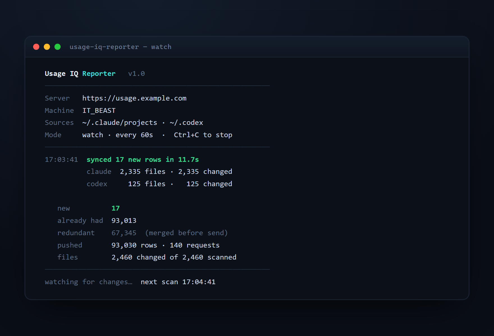

**1. Create an ingest key.** In the app: **Reporter** (top nav). Admins (`reporter.manage`) see and revoke everyone's keys; any user granted `reporter.self` can **generate and revoke their own** key and report their own usage, so a team self-onboards. **Generate key** → shown once, stored only as a hash; revoke anytime (effective on the next request). Every row is attributed to the **machine** it came from and to the **key's owner**, which powers the **Fleet** view.

**2. Run the reporter** on the machine that has the logs:

```bash
dotnet build src/Reporter -c Release
usage-iq-reporter --url https://usage.example.com --key uiq_xxxxxxxx…   # watch (default)
usage-iq-reporter --url https://usage.example.com --key uiq_… --once     # single pass (cron/Task Scheduler)
```

On Windows, [`Run-UsageIqReporter.ps1`](Run-UsageIqReporter.ps1) is a one-file "build + run the loop" launcher (asks for the key once, then it's a double-click). Prefer a GUI? The **[desktop agent](docs/agent.md)** (`src/Agent`) is the same engine as a **system-tray app** — a live activity view, a point-and-click Settings screen, and a run-at-sign-in checkbox — distributable as a single self-contained `.exe`.

The reporter de-dupes locally before sending (one billed turn spans several identical-key log lines — that's the `redundant` count), coalesces rows across files into batches, tracks per-file state so steady-state passes are cheap, and pins a **live combined-token counter** to the top-right (tokens newly ingested this session). Only parsed token counts/metadata are sent; the ingest key grants *write-only* access to `/api/ingest` and nothing else.

**Full guides** — install, flags, run-as-a-service, cloud hosting, the ingest API, and all config — are in **[docs/](docs/)**: [Reporter](docs/reporter.md) · [Desktop agent](docs/agent.md) · [Cloud hosting](docs/cloud-hosting.md) · [Ingest API](docs/ingest-api.md) · [Configuration](docs/configuration.md).

## API reference

| Method | Route | Purpose |
| --- | --- | --- |
| `POST` | `/api/auth/google` | Exchange a Google ID token for an app JWT (allowlist enforced). |
| `GET` | `/api/auth/me`, `/api/auth/config` | Current user + live permissions / public Google client id. |
| `GET`/`POST`/`PUT`/`DELETE` | `/api/users`, `/api/permissions` | User management (requires `users.manage`). |
| `POST` | `/api/users/{id}/logout` | **Force-logout** — bump the user's session version + push `SessionRevoked` (real-time sign-out; `users.manage`). |
| `POST` | `/api/sync` | Ingest new/changed JSONL files; returns counts + timing. |
| `POST` | `/api/ingest` | **Ingest-key authenticated** push of parsed usage from a remote reporter (anonymous to user auth; rate-limited). |
| `GET`/`POST`/`DELETE` | `/api/ingest-keys` | Reporter ingest keys — `reporter.manage` sees/revokes all, `reporter.self` manages only the caller's own; raw key shown once. |
| `GET` | `/api/sync/status` | Last-sync time + counts, whether a sync is running, and the auto-sync cadence. |
| `GET` | `/api/usage/summary` | Aggregates; params: `from,to,projectId[],model[],includeSidechain,groupBy`. |
| `GET` | `/api/usage/records` | Paged, sortable messages (same filters). |
| `GET` | `/api/usage/records.csv` | Streamed CSV of the filtered rows (requires `dashboard.view`). |
| `GET` | `/api/usage/calendar` | Per-day cost/tokens/messages + estimated active minutes & sessions. |
| `GET` | `/api/usage/cache-efficiency` | Cache-read ratio + dollars saved by caching + cache-write cost (same filters). |
| `GET` | `/api/fleet` | Per-machine and per-user usage rollups with last-seen (`dashboard.view`/`reporter.*`). |
| `GET`/`POST`/`PUT`/`DELETE` | `/api/saved-views` | Personal named filter sets (per-user, scoped to the caller). |
| `GET`/`PUT` | `/api/access-policy` | Open-sign-up toggle + default permission set (requires `users.manage`). |
| `GET`/`POST`/`DELETE` | `/api/shares` | Manage public share links (requires `dashboard.view`). |
| `GET` | `/api/share/{token}` | **Anonymous** read of a valid share — scoped aggregates only; 404 if expired/invalid. |
| `GET` / `PUT` / `POST` | `/api/notifications`, `/api/notifications/test`, `/api/notifications/snapshot` | Discord webhook config + test + send-now snapshot (`notifications.view`/`notifications.manage`). |
| `WS` | `/api/hubs/chat` | **SignalR** chat hub — send/react/typing/mark-read + server-pushed messages, notifications, `SessionRevoked` (`chat.*`). |
| `GET`/`POST` | `/api/chat/channels`, `/api/chat/direct` | List my channels + DMs (with unread counts); create a channel; open a DM (`chat.read`/`chat.send`). |
| `GET`/`POST` | `/api/chat/channels/{id}/messages`, `/api/chat/channels/{id}/read`, `/api/chat/channels/{id}` | Message history, send, mark-read; `DELETE` archives a channel (`chat.moderate`). |
| `PATCH`/`DELETE`/`POST` | `/api/chat/messages/{id}`, `/api/chat/messages/{id}/reactions` | Edit/delete a message (owner or `chat.moderate`); toggle an emoji reaction. |
| `GET`/`POST`/`DELETE` | `/api/chat/contacts/*`, `/api/chat/directory` | View the user directory + curate a user's contacts/circle (`chat.contacts.manage`). |
| `GET`/`POST`/`DELETE` | `/api/tracker/*` | Tracker day, food/exercise/weight/hydration/activity logging, profile, saved foods/exercises, library, sharing (`tracker.self`; read-others `tracker.viewall`). |
| `GET` | `/api/foods/search`, `/api/foods/{fdcId}` | Food lookup proxy — USDA primary, FatSecret fallback (text + barcode; `tracker.self`). |
| `GET`/`POST`/`PUT`/`DELETE` | `/api/family/*` | Family Hub — household, calendar, lists, notes, reminders, timer, meals, chores, polls, finance (`family.use`; finance also `family.finance`). |
| `GET`/`POST`/`PATCH`/`DELETE` | `/api/family/cycle/*` | Private cycle tracker — periods, deterministic predictions, settings, gentle AI note (`cycle.track`); `/overlay` exposes only predicted phases of opted-in members (`family.use`). |
| `GET` | `/api/family/locations` | Household finder — opted-in members' latest pins (name only, never email; `family.use`). |
| `GET`/`POST`/`PATCH` | `/api/location/*` | Own location history + settings (`location.self`/`location.share`); `/admin` map across users (`location.view-all`). |
| `GET` | `/api/ai-usage` | AI call log — feature/model/outcome/tokens/latency, **metadata only** (`ai.usage.view`). |
| `GET` | `/api/audit` | Recent user-management audit entries (requires `users.manage`). |
| `GET` | `/api/logs` | Recent request/response action log; filter by `method`/`status`/`q` (requires `users.manage`). |
| `GET` | `/api/projects`, `/api/models`, `/api/sources` | Filter options with totals. |
| `GET` | `/api/health`, `/health/ready` | Liveness (anonymous) and readiness (DB connectivity) probes. |
| `PUT` | `/api/sources/{id}` | Edit a source's path / enabled flag. |
| `GET` / `PUT` | `/api/pricing`, `/api/pricing/{id}` | View / edit per-model rates. |
| `POST` | `/api/pricing/recompute` | Re-price stored rows from current rates (no file re-read). |
| `GET` / `PUT` | `/api/settings` | Display timezone + projects path. |

## Configuration

Set via `.env`, environment variables, or `src/Api/appsettings.json`:

| Key | Default | Meaning |
| --- | --- | --- |
| `ConnectionStrings__Default` | `Host=localhost;Port=5433;…` | Postgres connection. |
| `Ingestion__ClaudeProjectsPath` | `<UserProfile>/.claude/projects` | Claude Code logs (editable in Settings). |
| `Ingestion__CodexPath` | `<UserProfile>/.codex` | Codex logs (editable in Settings). |
| `Ingestion__DisplayTimeZone` | `America/New_York` | IANA zone for day/month bucketing. |
| `AutoSync__Enabled` | `true` | Run the background incremental sync on a timer. |
| `AutoSync__IntervalSeconds` | `300` | Auto-sync cadence (min 30s). |
| `Cors__AllowedOrigin` | `http://localhost:4200` | Angular dev origin. |

Secrets (`Jwt:Key`, Google OAuth, email allowlists) live in git-ignored `src/Api/appsettings.Local.json`. The full set — plus all reporter settings — is in **[docs/configuration.md](docs/configuration.md)**.

## A note on `claude-fable-5` pricing

`claude-fable-5` has no public price, so it ships with an **estimated** rate (Opus-tier). Set the real rate on the **Pricing** page and hit **Recompute** — all stored rows re-price instantly. The known Opus / Haiku rates are best-effort defaults and equally editable. The dashboard's *placeholder-pricing* warning now appears only for models that are **genuinely unpriced** (matched solely by the `*` fallback), not for intentional estimates.

## Project structure

```
usage-iq/
├─ docker-compose.yml          # db (default) + api/web (--profile full)
├─ .github/workflows/ci.yml    # build API + reporter + Angular, run dotnet test
├─ Run-UsageIqReporter.ps1     # Windows "build + run the reporter loop" launcher
├─ docs/                       # reporter, cloud-hosting, ingest-API, configuration guides
├─ tests/
│  └─ Ccusage.Api.Tests/       # xUnit: unit + Testcontainers integration tests
└─ src/
   ├─ Ingestion/               # shared parser library (Claude + Codex JSONL → ParsedUsage)
   ├─ Api/                     # .NET 9 minimal API
   │  ├─ Data/                 # EF entities, DbContext, pricing seed
   │  ├─ Ingestion/            # sync, dedup, cost, project/timezone resolve, HTTP ingest write path
   │  ├─ Services/             # queries, recompute, sync coordinator, audit, Discord/chat notifiers, USDA/FatSecret/WorkoutX clients
   │  ├─ Auth/                 # JWT (+ session version), per-request permission filter, ingest-key filter
   │  ├─ Hubs/                 # SignalR ChatHub (chat, notifications, real-time force-logout)
   │  ├─ Infrastructure/       # global exception handler, request-logging middleware
   │  └─ Endpoints/            # API surface (usage, chat, tracker, users, …)
   ├─ ReporterCore/            # shared reporter engine: scan/parse/push, structured events, config loader
   ├─ Reporter/                # console app on ReporterCore: parse local logs, push to /api/ingest
   ├─ Agent/                   # Windows system-tray desktop app on ReporterCore (WPF + tray NotifyIcon)
   └─ Web/                     # Angular 21 (standalone + signals, ECharts, SignalR)
      └─ src/app/{features/{dashboard,calendar,pricing,settings,reporter,fleet,chat,tracker,notifications,users,logs,login},core,shared}
```

## License

[MIT](LICENSE)
