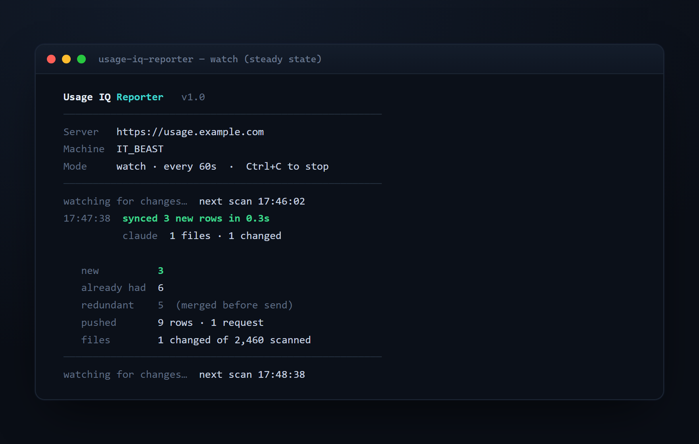

# Reporter

The **reporter** (`usage-iq-reporter`) is a small .NET 9 console app that runs on a machine with
Claude Code / Codex logs, parses them **locally**, and pushes only the parsed usage — token counts and
metadata, **never** prompt or response text — to a hosted Usage IQ API. It's how you keep the API and
database in the cloud while the logs stay on your workstation.


The server stays authoritative: it prices each row, resolves the project from `cwd`, and de-dupes on a
unique key. So re-running the reporter is idempotent, and remote rows merge with any local sync.

## 1. Generate an ingest key

In the dashboard: **Reporter** (top nav, requires the `settings.manage` permission) → **Generate key**.
Copy it immediately — it's shown once and stored only as a SHA-256 hash. Revoke anytime; revocation
takes effect on the reporter's next request. Keys can also be managed via the [Ingest API](ingest-api.md).

## 2. Get the reporter

```bash
git clone https://github.com/itdept-ops/usage-iq && cd usage-iq
dotnet build src/Reporter -c Release
# binary: src/Reporter/bin/Release/net9.0/usage-iq-reporter(.exe)
```

Or run straight from source with `dotnet run --project src/Reporter -- <args>`.

## 3. Run it

```bash
# watch continuously (default) — pushes new usage as it appears
usage-iq-reporter --url https://usage.example.com --key uiq_xxxxxxxx…

# single pass then exit (e.g. from cron / Task Scheduler)
usage-iq-reporter --url https://usage.example.com --key uiq_… --once
```

| Option | Default | Meaning |
| --- | --- | --- |
| `-u, --url` | — | **Required.** Usage IQ API base URL. |
| `-k, --key` | — | **Required.** Ingest key. Treat as a secret. |
| `-m, --machine` | OS hostname | Label this machine reports under. |
| `--claude-path` | `~/.claude/projects` | Claude Code logs directory. |
| `--codex-path` | `~/.codex` | Codex sessions directory. |
| `--state` | `~/.usage-iq/reporter-state.json` | Per-file sync state (so only changed files are re-read). |
| `--batch` | `500` | Rows per request (server caps at 5000). |
| `--interval` | `60` | Watch poll interval, seconds (5–3600). |
| `--once` | — | Single pass then exit (otherwise watches). |

Config can also come from `REPORTER_*` environment variables or an `appsettings.json` next to the
executable — see [Configuration](configuration.md).

## PowerShell launcher (Windows)

The repo ships [`Run-UsageIqReporter.ps1`](../Run-UsageIqReporter.ps1) — a one-file "build + run the
loop" launcher. Move it anywhere (it finds the repo via `-RepoRoot`). On first run it asks for your key
once and can save it to a `reporter.key` file beside the script, so afterwards it's just
right-click → **Run with PowerShell**.

```powershell
powershell -ExecutionPolicy Bypass -File .\Run-UsageIqReporter.ps1            # build + watch
powershell -ExecutionPolicy Bypass -File .\Run-UsageIqReporter.ps1 -Once      # single pass
powershell -ExecutionPolicy Bypass -File .\Run-UsageIqReporter.ps1 -NoBuild   # skip the rebuild
```

## Run it as a service

Keep the watcher alive across reboots, or schedule `--once` on a timer.

**Linux (systemd)** — `/etc/systemd/system/usage-iq-reporter.service`:

```ini
[Unit]
Description=Usage IQ reporter
After=network-online.target

[Service]
Environment=REPORTER_URL=https://usage.example.com
Environment=REPORTER_KEY=uiq_xxxxxxxx…
ExecStart=/opt/usage-iq/usage-iq-reporter
Restart=always
RestartSec=10

[Install]
WantedBy=multi-user.target
```

```bash
sudo systemctl enable --now usage-iq-reporter
journalctl -u usage-iq-reporter -f
```

**Windows (Task Scheduler)** — run at logon:

```powershell
schtasks /create /tn "UsageIQ Reporter" /sc onlogon `
  /tr "C:\usage-iq\usage-iq-reporter.exe --url https://usage.example.com --key uiq_…"
```

**cron (hourly one-shot)**:

```cron
0 * * * * /opt/usage-iq/usage-iq-reporter --url https://usage.example.com --key uiq_… --once
```

## How it works

When it watches, only changed files do any work, so steady-state passes are cheap:



- **Per-file state.** Each file's size + last-write time is recorded in the state file after its rows
  push successfully. Unchanged files are skipped next pass; an interrupted push is retried (the server
  de-dupes, so retries never double-count).
- **Local de-dup.** Claude/Codex write one JSONL line per content event, and a single billed API turn
  spans several lines that all carry the same key. The reporter sends each distinct key **once** — the
  `redundant` count in the summary is how many duplicate lines it merged before sending (typically
  ~40%). This is why a pass "skips" rows: it's redundancy, not lost data.
- **Cross-file batching.** Distinct rows are coalesced across files into batches (`--batch`), so a
  backfill of thousands of small files is ~`rows/batch` requests, not one per file.
- **Privacy.** Only `ParsedUsage` (timestamp, model, token counts, session id, `cwd`, git branch,
  sidechain flag, version) is sent. No prompt or response text ever leaves the machine.

## Troubleshooting

| Symptom | Cause / fix |
| --- | --- |
| `Server returned 429` | You're on an old build (per-file requests) or pushing very fast. Rebuild from latest (cross-file batching); the server allows 600 requests/min/IP. The reporter also backs off and retries 6×. |
| `Ingest key was rejected (401/403)` | Wrong/revoked key, or wrong `--url`. Generate a fresh key on the Reporter page. |
| `WARNING: --url is http://…` | The key would travel in cleartext to a non-local host. Use `https://`. |
| Lots of `redundant` rows | Expected — see **Local de-dup** above. `new` + `already had` is the real distinct count. |
| `unpriced model(s)` warning | A model has no rate yet. Set it on the **Pricing** page, then **Recompute**. |
| Nothing ingested | Check `--claude-path` / `--codex-path` point at real log dirs on this machine. |

See also: [Cloud hosting](cloud-hosting.md) · [Ingest API](ingest-api.md) · [Configuration](configuration.md).
